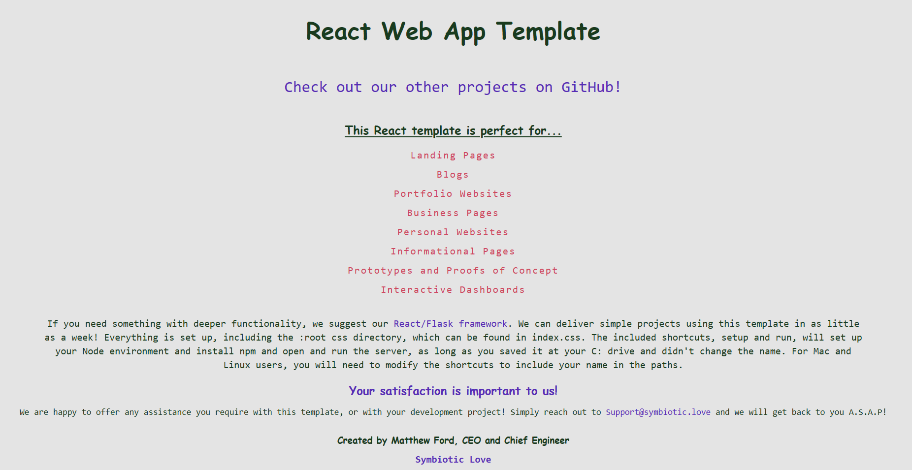

<h1>Simple React Boilerplate</h1>
This is a simple boilerplate template for a React app created with npx. In the index.css file, a :root has been defined for consistent styling across the application. Fork this repository directly at your C: drive if you want to be able to use the shortcuts, or modify the paths to them. Mac and Linux users will need to modify the shortcut paths to include their username. We recommend this platform for lightweight applications that do not require a dedicated server to handle data. For landing pages, blogging sites, business information websites, and more, this simple application framework will be perfect. If you need to add a lightweight back-end, check out our <a href="https://github.com/SymbioticLove/React-Flask-Boilerplate">React/Flask boilerplate</a>!

&nbsp

